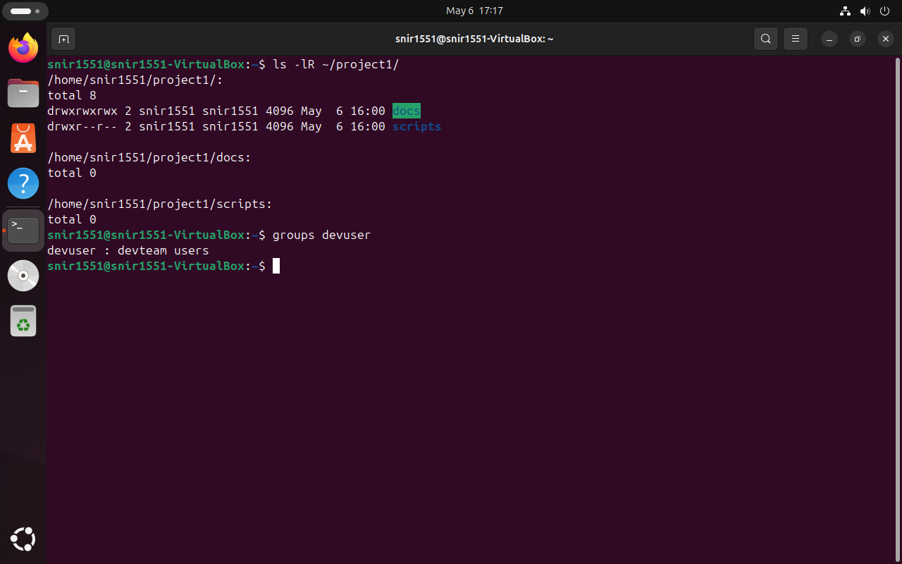

# DevOps-Linux
<br />
<details>
    
<summary>Study</summary>
<br />

<details> 
<summary>Theory</summary>
    
<br />


</details>

<details> 
<summary>Linux Commands</summary>
    
<br />


<details>
<summary>Basic Linux Commands (CLI - Part 2)</summary>
<br />

General Operations:
- `clear` = Clears the terminal

Directory Operatings:
- `pwd` = Show current directory. Example Output: `/home/nana`
- `ls` = List folders and files. Example Output: `Desktop  Downloads  Pictures  Documents`
- `cd [dirname]` = Change directory to [dir]
- `mkdir [dirname]` = Make directory [dirname]
- `cd ..` = Go up a directory

File Operations:
- `touch [filename]` = Create [filename]
- `rm [filename]` = Delete [filename]
- `rm -r [dirname]` = Delete a non-empty directory and all the files in it
- `rm -d [dirname]` or `rmdir [dirname]` = Delete an empty directory

Navigating in the File System:
- `cd usr/local/bin` = Navigate multiple dirs (relative path - relative to current dir). Move to bin directory
- `cd ../..` = Move up 2 hierarchies, so go to 'usr' directory
- `cd /usr` = Alternative to go to 'usr' directly (absolute path)
- `cd [absolute path]` = Move to any location by providing the full path
- `cd /home/nana` = Go to my home directory (absolute path)
- `cd ~` = Shortcut alternative to go to home directory
- `ls /etc/network` = List folders and files of 'network' directory

More File and Directory Operations
- `mv [filename] [new_filename]` = Rename the file to a new file name
- `cp -r [dirname] [new_dirname]` = Copy dirname to new_dirname recursively meaning including the files
- `cp [filename] [new_filename]` = Copy filename to new_filename

Some more useful commands
- `ls -R [dirname]` = Show dirs and files but also sub dirs and files
- `history` = Gives a list of all past commands typed in the current terminal session
- `history 20` = Show list of last 20 commands
- `CTRL + r` = Search history
- `CTRL + c` = Stop current command
- `CTRL + SHIFT + v` = Paste copied text into terminal
- `ls -a` = See hidden files too
- `cat [filename]` = Display the file content
- `cat .bash_history` = Example 1: Display the file content
- `cat Documents/java-app/Readme.md` = Example 2: Display the file content
 
Display OS Information
- `uname -a` = Show system and kernel
- `cat /etc/os-release` =  Show OS information
- `lscpu` = Display hardware information, e.g. how many CPU you have etc.
- `lsmem` = Display memory information

Execute commands as superuser
- `sudo [some command]` = Allows regular users to run programs with the security privileges of the superuser or root
- `su - admin` = Switch from nana user to admin
</details>

******

<details>
<summary>Package Manager - Installing Software on Linux</summary>
<br />

APT Package Manager:
- `sudo apt search [package_name]` = Search for a given package
- `sudo apt install [package_name]` = Install a given package
- `sudo apt install [package_name] [package_name2]` = Install multiple packages with one command
- `sudo apt remove [package_name]` = Remove installed package
- `sudo apt update` = Updates the package index. Pulls the latest change sfrom the APT repositories

APT-GET Package Manager:
- `sudo apt-get install [package_name]` = Install package with apt-get package manager

SNAP Package Manager:
- `sudo snap install [package_name]` = Install a given package


</details>

******

<details>
<summary>Working with Vim Editor</summary>
<br />

Install Vim, if it's not available:
- `sudo apt install vim` = Search for a given package

There are 2 Modes:
- Command Mode: default mode, everything is interpreted as a command
- Insert Mode: Allows to enter text

Vim Commands:
- `vim [filename]` = Open file with Vim
- `Press i key` = Switch to Insert Mode
- `Press esc key` = Switch to Command Mode
- `Type :wq` = Write File to disk and quit Vim
- `Type :q!` = Quit Vim without saving the changes
- `Type dd` = Delete entire line
- `Type d10` = Delete next 10 lines
- `Type u` = Undo
- `Type A` = Jump to end of line and switch to insert mode
- `Type 0` = Jump to start of the line
- `Type $` = Jump to end of the line
- `Type 12G` = Go to line 12
- `Type 16G` = Go to line 16
- `Type /pattern` = Search for pattern, e.g. `/nginx`
    - `Type n` = Jump to next match
    - `Type N` = Search in opposite direction
- `Type :%s/old/new` = Replace 'old' with 'new' throughout the file

</details>

******


<details>
<summary>Linux Accounts & Groups (Users & Permissions Part 1)</summary>
 <br />

**Locations of Access Control Files:**
- /etc/passwd
- /etc/shadow
- /etc/group
<!-- -->
- `sudo adduser [username]` = Create a new user
- `sudo passwd [username]` = Change password of a user
- `su - [username]` = Login as username ('su' = short for substitute or switch user)
- `su -` = Login as root
<!-- -->
- `sudo groupadd [groupname]` = Create new group (System assigns next available GID)
- `sudo adduser [username]` = Switch to Insert Mode

**Note 2 different User/Group commands:**<br />
`adduser`, `addgroup`, `deluser`,  `delgroup` = interactive, more user friendly commands<br />
`useradd`, `groupadd`,  `userdel`,  `groupdel` = low-level utilities, more infos need provided by yourself

- `sudo usermod [OPTIONS] [username]` = Modify a user account
- `sudo usermod -g devops tom` = Assign 'devops' as the primary group for 'tom' user
- `sudo delgroup tom` = Removes group 'tom'
- `groups` = Display groups the current logged in user belongs to
- `groups [username]` = Display groups of the given username
- `sudo useradd -G devops nicole` = Create 'nicole' user and add nicole to 'devops' group (-G = secondary group, not primary)
- `sudo gpasswd -d nicole devops` = Removes user 'nicole' from group 'devops'

</details>

******

<details>
<summary>File Ownership & Permissions (Users & Permissions Part 2)</summary>
 <br />

- `ls -l` = Print files in a long listing format, you can see ownership and permissions of the file

**Ownership:**
- `sudo chown [username]:[groupname] [filename]` = Change ownership
- `sudo chown tom:admin test.txt` = Change ownership of 'test.txt' file to 'tom' and group 'admin'
- `sudo chown admin test.txt` = Change ownership of 'test.txt' 'admin' user
- `sudo chgrp devops test.txt` = Make 'devops' group owner of test.txt file

**Possible File Permissions (Symbolic):**
- r = Read
- w = Write
- x = Execute
- '-' = No permission

**Change File Permissions for different owners**

File Permissions can be changed for:
- u = Owner
- g = Group
- o = Other (all other users)

Minus (-) removes the permission
- `sudo chmod -x api` = Takes 'execute' permission away for 'api' folder from all owners
- `sudo chmod g-w config.yaml` = Takes 'write' permission away for 'config.yaml' file from the group 

Plus (+) adds permission
- `sudo chmod g+x config.yaml` = Add 'execute' permission for 'config.yaml' file to the group 
- `sudo chmod u+x script.sh` = Add 'execute' permission for 'script.sh' file to the user 
- `sudo chmod o+x script.sh` = Add 'execute' permission for 'script.sh' file to other 

Change multiple permissions for an owner
- `sudo chmod g=rwx config.yaml` = Assign 'read write execute' permissions to the group
- `sudo chmod g=r-- config.yaml` = Assign only 'read' permission to the group

Changing permissions with numeric values

_Set permissions for all owners with 3 digits, 1 digit for each owner_ [Absolute vs Symbolic Mode](https://docs.oracle.com/cd/E19455-01/805-7229/6j6q8svd8/)

- 0 = No permission
- 1 = Execute
- 2 = Write
- 3 = Execute + Write
- 4 = Read
- 5 = Read + Execute
- 6 = Read + Write
- 7 = Read + Write + Execute
<!-- -->
- `sudo chmod 777 script.sh` = rwx (Read, Write and Execute) permission for everyone for file 'script.sh'
- `sudo chmod 740 script.sh` = Give user all permissions (7), give group only read permission (4), give other no permission (0)


</details>

******

<details>
<summary>Introduction to Shell Scripting - Part 1 </summary>
 <br />

Create and open setup.sh file in vim editor: <br />
`vim setup.sh`

In setup.sh file:
```sh
#!/bin/bash

echo "Setup and configure server"

# save file with 
ESC :wq 

# make file executable
chmod u+x setup.sh

# execute script
./setup.sh 
bash setup.sh
```

</details>

******

<details>
<summary>Shell Scripting Part 2 - Concepts & Syntax </summary>
 <br />

**Variables:**
```sh
#!/bin/bash

echo "Setup and configure server"

file_name=config.yaml
config_files=$(ls config)

echo "using file $file_name to configure something"
echo "here are all configuration files: $config_files"
```

**Conditions:**
```sh
#!/bin/bash

echo "Setup and configure server"

file_name=config.yaml
config_dir=$1

if [ -d "$config_dir" ]
then
 echo "reading config directory contents"
 config_files=$(ls "$config_dir")
else 
 echo "config dir not found. Creating one"
 mkdir "$config_dir"
 touch "$config_dir/config.sh"
fi


# example conditional for checking file
# if [ -f "config.yaml" ]

# example conditional for checking numbers
# num_files=xx
# if [ "$num_files" -eq 10 ]

# example conditional for checking strings
user_group=$2
if [ "$user_group" == "nana" ]
then 
 echo "configure the server"
elif [ "$user_group" == "admin" ]
then
	echo "administer the server" 
else
 echo "No permission to configure server. wrong user group"
fi

echo "using file $file_name to configure something"
echo "here are all configuration files: $config_files"
```

**User input:**
```sh
#!/bin/bash

echo "Reading user input"

read -p "Please enter your password: " user_pwd
echo "thanks for your password $user_pwd"
```

**Script Parameters:**
```sh
#!/bin/bash

echo "all params: $*"
echo "number of params: $#"

echo "user $1"
echo "group $2"
```


**Executing with script parameters:**

`./example.sh name lastname # 2 params`

`./example.sh "name lastname" # 1 param`

`bash example name lastname`

**Loops:**
```sh
#!/bin/bash

echo "all params: $*"
echo "number of params: $#"

for param in $*
 do 
  if [ -d "$param" ] 
  then
   echo "executing scripts in the config folder"
   ls -l "$param"
  fi 

  echo $param
 done

sum = 0
while true
 do 
	read -p "enter a score" score

  if [ "$score" == "q" ]
  then
   break
  fi

  sum=$(($sum+$score))
  echo "total score: $sum"
 done
```

</details>

******


<details>
<summary>Shell Scripting Part 3 - Concepts & Syntax </summary>
 <br />

**Functions:**
```sh
#!/bin/bash

echo "all params: $*"
echo "number of params: $#"

for param in $*
 do 
  if [ -d "$param" ] 
  then
   echo "executing scripts in the config folder"
   ls -l "$param"
  fi 

  echo $param
 done

# Declare function
function score_sum {
  sum = 0
	while true
	 do 
		read -p "enter a score" score
	
	  if [ "$score" == "q" ]
	  then
	   break
	  fi
	
	  sum=$(($sum+$score))
	  echo "total score: $sum"
	 done
}

# Invoke function
score_sum

function create_file() {
	file_name=$1
  is_shell_script=$2
  touch $file_name
  echo "file $file_name created" 

  if [ "$is_shell_script" = true ]
  then
		chmod u+x $file_name
		echo "added execute permission"
	fi
}

# Invoke with diff params
create_file test.txt
create_file myfile.yaml
create_file myscript.sh

# Function with return value
function sum() {
	total=$(($1+$2))
  return $total
}

sum 2 10
result=$?

echo "sum of 2 and 10 is $result"
```

</details>

******

<details>
<summary>Basic Linux Commands - Pipes & Redirects (CLI - Part 3)</summary>
<br />

**Pipe & Less:**

Pipe Command:
- `|` = Pipe command = Pipes the output of the previous command as an input to the next command

Less Command:
- `less [filename]` = Displays the contents of a file or a command output, one page at a time. And allows to navigate forward and backward through the file

Different piping examples/use cases:
- `cat /var/log/syslog | less` = Pipes the output of 'syslog' file to less program.
- `ls /usr/bin | less` = Pipes the output of ls command to less program.
- `history | less` = Pipes the output of history command to less program.

**Pipe & Grep:**

Grep Command:
- `grep [pattern]` = Searches for a particular pattern of characters and displays all lines that contain that pattern

More piping examples/use cases:
- `history | grep sudo` = Look for any commands of history commands, which have 'sudo' word in it
- `history | grep "sudo chmod"` = Look for any commands of history commands, which have 'sudo chmod' phrase in it
- `history | grep sudo | less` = History output will pass output to grep and filter for 'sudo' and this output will again be piped or passed to less program
- `ls /usr/bin/ | grep java` = Filter ls output for java
- `cat Documents/java-app/config.yaml | grep ports` = See all 'ports' occurences in config.yaml file

**Redirects in Linux:**
- `>` = Redirect Operator = Takes the output from the previous command and sends it to a file that you give

Different redirects examples/use cases:
- `history | grep sudo > sudo-commands.txt` = Redirect output into a 'sudo-commands.txt' file
- `cat sudo-commands.txt > sudo-rm-commands.txt` = Redirect output of 'sudo-commands.txt' file into 'sudo-rm-commands.txt' file
- `history | grep rm > sudo-rm-commands.txt` = Redirect output of filtered history commands into existing 'sudo-rm-commands.txt' file. Note: Contents of file will be _overwritten_
- `history | grep rm >> sudo-rm-commands.txt` = Redirect output of filtered history commands into existing 'sudo-rm-commands.txt' file. Note: Contents of file will be _appended_

</details>

******

<details>
<summary>Environment Variables</summary>
<br />

_Variables store information. Environment variables are available for the whole environment._
_An environment variable consists of _name=value_ pair._

**Existing Environment Variables:**
- `SHELL=/bin/bash`= default shell program, in this case bash
- `HOME=/home/nana`= current user's home directory
- `USER=nana` = currently logged in user
<!-- -->
- `printenv` = List all environment variables
- `printenv | less` = List all environment variables with less program
- `printenv [environment variable]` = Display value of given environment variable, e.g. `printenv USER`
- `printenv | grep USER` = Filter environment variables, which have 'USER' in the name
<!-- -->
- `echo $USER` = Print value of USER environment variable

**Create own Environment Variables:**
- `export DB_USERNAME=dbuser` = Set environment variable 'DB_USERNAME' with value 'dbuser'
- `export DB_PASSWORD=secretpwdvalue` = Set environment variable 'DB_PASSWORD' with value 'secretpwdvalue'
- `export DB_NAME=mydb` = Set environment variable 'DB_NAME' with value 'mydb'
- `printenv | grep DB` = Filter environment variables for 'DB' characters
- `export DB_NAME=newdbname` = Set environment variable 'DB_NAME' to new value 'newdbname'

**Delete Environment Variables:**
- `unset DB_NAME` = Delete variable with name 'DB_NAME'

**Persisting Environment Variables:**

Persisting Environment Variables with shell specific configuration file:
_Environment variables set in terminal are only available in the current terminal session._

Add environment variables to the '~/.bashrc' file or your specific shell 'rc' file. Variables set in this file are loaded whenever a bash login shell is entered.
- `export DB_USERNAME=dbuser`
- `export DB_PASSWORD=secretvl`
- `export DB_NAME=mydb`
In terminal again:
- `source ~/.bashcrc` = Load the new env vars into the current shell session

Persisting Environment Variables system wide:
- ~./bashrc = user specific
- /etc/environment = system wide, meaning all users will have access to the variables

**PATH Environment Variable:**
- `PATH=/usr/local/sbin:/usr/local/bin:/usr/sbin:/usr/bin:/sbin:/bin` = List of directories to executible files, separated by ':'. Tells the shell which directories to ssearch for the executable in response to our executed command
- `PATH=$PATH:/home/nana` = Appending /home/nana folder to the existing $PATH value


</details>

******

<details>
<summary>Networking</summary>
<br />

Useful Networking Commands:
- `ip`= one of the basic commands. For setting up new systems and assigning IPs to troubleshooting existing systems. Can show address information, manipulate routing, plus display network various devices, interfaces, and tunnels.
- `ifconfig`= for configuring and troubleshooting networks. It has since been replaced by the `ip` command
- `netstat`= tool for printing network connections, routing tables, interface statistics, masquerade connections, and multicast memberships
- `ps aux` =
  - ps = displays information about a selection of the active processes
  - a = show processes for all users
  - u = display the process's user/owner
  - x = also show processes not attached to a terminal
- `nslookup` = Find DNS related query
- `ping` = To check connectivity between two nodes

</details>

******

<details>
<summary>SSH - Secure Shell</summary>
<br />

Connecting via SSH: `ssh username@SSHserver`
- `ssh root@64.225.108.160`= Connect with root user to 64.225.108.160 server address
- `ssh-keygen -t rsa`= Create SSH Key Pair with 'rsa' algorithm. SSH Key Pair is stored to the default location `~/.ssh`
- `ls .ssh/`= Display contents of .ssh folder, which has:
  - `id_rsa` = Private Key
  - `id_rsa.pub` = Public Key
- `ssh -i .ssh/id_rsa root@64.225.108.160` = Connect with root user to 64.225.108.160 server address with specified private key file location (.ssh/id_rsa = default, but you can specify a different one like this)

Two Files used by SSH:
- `~/.ssh/known_hosts` = lets the client authenticate the server to check that it isn't connecting to an impersonator
- `~/.ssh/authorized_keys` = lets the server authenticate the user

</details>

</details>

</details>

******

<details>
<summary>Tasks</summary>
<br />

<details>
<summary>Week 1 Tasks – Intro to DevOps & Linux</summary>
<br />

## 1. Basic Linux Commands

```bash
# Basic commands to Navigate and manage directories

pwd                   # Print current directory
ls                    # List contents of the directory
mkdir devops_test     # Create new directory
cd devops_test        # Change to that directory
touch testfile.txt    # Create a test file
rm testfile.txt       # Delete the test file
cd ..                 # Go back one directory (can also do cd ../../ and etc)
rm -r devops_test     # Delete the directory
```

## 2. Create Users and Assign to Custom Group

```bash
# Create a new group
sudo groupadd devopsteam

# Create users and assign them to the group
sudo useradd -m -G devopsteam user1
sudo useradd -m -G devopsteam user2

# Verify group membership
groups user1
groups user2
```


## 3. Change File and Directory Permissions

```bash
# Create a directory and a file
mkdir /tmp/secure_folder
touch /tmp/secure_folder/groupfile.txt

# Change ownership to a user and group
sudo chown user1:devopsteam /tmp/secure_folder/groupfile.txt

# Change permissions to allow group read/write
sudo chmod 660 /tmp/secure_folder/groupfile.txt

# Verify permissions
ls -l /tmp/secure_folder/groupfile.txt
```

</details>

******


<details>
<summary>Week 1 Summary Task – DevOps & Linux Basics</summary>
<br />

## Part 1: Creating Directory Structure & Permissions

```bash
# Create base project directory in user's home directory
mkdir -p ~/project1/docs ~/project1/scripts

# Set permissions
chmod 744 ~/project1/scripts  # Owner: rwx, Group/Others: r--
chmod 777 ~/project1/docs     # Everyone: rwx (write access for all users)
```

## Part 2: User & Group Management

```bash
# Create user and group
sudo groupadd devteam
sudo useradd -g devteam devuser

# Set 'project1' ownership to your user and give group read-only access
sudo chown $USER:devteam ~/project1
chmod 740 ~/project1  # Owner: rwx, Group: r--, Others: ---
```

## Part 3: Verification Commands

```bash
# Show final directory structure and permissions
ls -lR ~/project1

# Show group membership for devuser
groups devuser
```
Screenshot of the outcome:  

## Command Explanations

- `mkdir -p`: Creates directories; `-p` ensures parent directories are made as needed.
- `chmod 744`: Sets file/directory permissions (`7`=rwx, `4`=r--).
- `chmod 777`: Gives full read/write/execute permissions to all.
- `groupadd`: Adds a new group to the system.
- `useradd -m -g`: Creates a user and assigns him to a primary group.
- `chown`: Changes ownership of a file or directory.
- `ls -lR`: Recursively lists directory contents with permissions.
- `groups`: Shows all groups a user belongs to.


</details>

******


<details>
<summary>Week 2 Task – Advanced Log Report Automation</summary>
<br />

## 🧠 Task Overview

Develop a Bash script that:

- Accepts a log directory path
- Accepts one or more keywords to search for
- Counts keyword occurrences in .log files
- Generates reports in both .txt and .csv formats
- Supports both interactive and argument-based usage

---


### ✅ CLI Options

| Flag           | Description                                                  |
|----------------|--------------------------------------------------------------|
| --keywords     | Space-separated list of keywords to search in .log files     |
| --logdir       | Directory containing the log files                           |
| --interactive  | Run in interactive mode (ask for directory & keywords)       |
| --help         | Show help message                                            |

### 📄 Output

- report.txt – Human-readable report in tabular format
- report.csv – CSV file for spreadsheet or script integration

---


### 🐚 Bash Script Commands Reference

This document provides a categorized reference of Bash commands, operators, and syntax elements used in the script.

---

#### 🧠 General Bash Concepts

| Command | Description |
|--------|-------------|
| `#!/bin/bash` | Declares that the script is written for the Bash shell. |
| `function name() { ... }` | Defines a reusable block of code (function). |
| `local file` | Declares a local variable named `file` that is only accessible within the current function. |
| `exit 1` | Stops the script with an error status (non-zero). |

---

#### 📥 Arguments and Parameters

| Command | Description |
|--------|-------------|
| `$0` | Represents the name of the script or function being executed. |
| `$1` | Refers to the first positional argument passed to the script or function. |
| `$#` | Represents the number of positional arguments passed to a script or function. |
| `"$@"` | Represents **all arguments** passed to the script. |

---

#### 🔁 Loops and Conditions

| Command | Description |
|--------|-------------|
| `if [ condition ]; then ... fi` | Basic conditional structure used to execute code based on a condition. |
| `while read -r file; do ... done` | Loops over each line or file passed through the pipe safely. |
| `for var in list; do ... done` | Loops over each item in a list or array and performs commands for each. |
| `case "$1" in ...)` | Used to handle multiple options or flags like `--help`, `--logdir`, etc. |
| `if [ ! -d "$LOG_DIR" ]` | Checks if the directory in `LOG_DIR` does **not** exist. |

---

#### 🧮 Arithmetic Operators

| Command | Description |
|--------|-------------|
| `-eq` | Returns true if two numbers are equal. |
| `-ne` | Returns true if two numbers are not equal. |
| `-gt` | Returns true if the first number is greater than the second. |
| `-lt` | Returns true if the first number is less than the second. |
| `-ge` | Returns true if the first number is greater than or equal to the second. |
| `-le` | Returns true if the first number is less than or equal to the second. |
| `$(( expression ))` | Performs arithmetic operations like addition, subtraction, etc. |

---

#### 📋 Variables and Arrays

| Command | Description |
|--------|-------------|
| `KEYWORDS=()` | Initializes an empty array called `KEYWORDS`. |
| `KEYWORDS=(ERROR WARNING CRITICAL)` | Declares an array with values. |
| `KEYWORDS[@]` | Expands to all elements of the array (each element quoted separately). |
| `KEYWORDS[*]` | Expands to all elements as a single word (joined by IFS). |
| `${#ARRAY[@]}` | Returns the number of elements in an array. |

---

#### ⌨️ Input

| Command | Description |
|--------|-------------|
| `read -p "..." VAR` | Prompts the user for input and stores it in `VAR`. |
| `read -a ARRAY` | Reads multiple words into an array. |

---

#### 🖨️ Output and Formatting

| Command | Description |
|--------|-------------|
| `echo` / `echo "text"` | Prints text or variables to the terminal. |
| `printf` | Formats and prints text with fine control (padding, precision, etc.). |
| `%-10s` | A `printf` format specifier: left-aligns string in a 10-character width. |

---

#### 📁 Files and Redirection

| Command | Description |
|--------|-------------|
| `>` | Overwrites a file with new content. |
| `>>` | Appends output to a file without overwriting. |

---

#### 🔍 File Searching & Reading

| Command | Description |
|--------|-------------|
| `find` | Searches files and directories recursively. |
| `find DIR -type f -name "*.log"` | Finds all `.log` files inside `DIR` and its subdirectories. |

---

#### 🔎 Text Processing

| Command | Description |
|--------|-------------|
| `grep -o` | Prints only the matched parts of each line. |
| `grep -o "word" file` | Finds and prints each match of `"word"` in the file, one per line. |
| `wc -l` | Counts the number of lines in input. Often used to count matches. |
| `sed` | A stream editor used to perform basic text transformations on input. Example: `sed 's/old/new/'` replaces the first occurrence of `old` with `new`. |
| `awk` | A powerful text-processing tool. Example: `awk '{ print $1 }'` prints the first word of each line. |

---

#### ⏱️ Time & Date

| Command | Description |
|--------|-------------|
| `date` | Displays the current date and time. |
| `date +%s` | Returns the current time in seconds since epoch (used for timing). |
| `date +%s.%N` | Returns time in seconds with nanosecond precision. |
| `date +"%Y-%m-%d %H:%M:%S.%3N"` | Prints the full date and time with milliseconds. |


</details>

---


<details>
<summary>Week 3 Task – Remote Log Monitoring with SSH & VM</summary>
<br />

## 🧠 Task Overview

Create a modular Bash script that:

- Connects to a remote Linux VM over SSH using a `.pem` key
- Downloads `.log` files (either all, or only those modified in the last 24 hours)
- Automatically extracts `.zip`, `.tar`, or `.tar.gz` files
- Passes logs to a secondary script (`advanced_log_report.sh`) for keyword analysis
- Generates `remote_report.txt` and `remote_report.csv`
- Adds metadata (remote server, path) to the report
- Optionally sends the report to your email

---

## ✅ CLI Options

| Flag       | Description                                                                 |
|------------|-----------------------------------------------------------------------------|
| `--all`    | Download all logs, not just recent ones                                     |
| `--email`  | Automatically prompt for email address and send the report after analysis   |
| `--help`   | Display the help message and exit                                           |

---

## 🧪 Sample Execution

```
# Basic usage: downloads recent logs, prompts interactively
./remote_log_analyzer.sh snir1551@20.217.201.167

# Download all logs from the directory
./remote_log_analyzer.sh snir1551@20.217.201.167 --all

# Download all logs and email the report automatically
./remote_log_analyzer.sh snir1551@20.217.201.167 --all --email

```

## 🧪 Example: Full Execution Output

```
$ ./remote_log_analyzer.sh snir1551@20.217.201.167

- Enter the remote log directory path: /home/snir1551/logs

Downloading ALL logs from snir1551@20.217.201.167:/home/snir1551/logs...
logs/app.log                           100%   14KB 140.5KB/s   00:00
logs/errors.zip                        100%   10KB 122.3KB/s   00:00

Extracting archives...
Archive extracted: logs/errors.zip → logs/errors/

- Using provided log directory: ./downloaded_logs

- Enter keywords to search for (separated by space): ERROR WARNING CRITICAL

LOG REPORT
Directory: ./downloaded_logs
Keywords: ERROR WARNING CRITICAL
Generated at: Thu May 22 04:43:11 IDT 2025

Log File: app.log
Keyword     | Occurrences
-------------------------
ERROR       | 14
WARNING     | 3
CRITICAL    | 0

Report generated successfully!

- Would you like to send the report via email? (yes/no): yes
Enter your email address: snir@example.com
📧 Email sent to snir@example.com with full report.

✅ Done. Total Execution Time: 5.284 seconds
📝 Report: remote_report.txt
📊 CSV: remote_report.csv

```

## 📂 Generated Output Example

📄 Output

| File                | Description                                  |
| ------------------- | -------------------------------------------- |
| `remote_report.txt` | Human-readable summary with metadata         |
| `remote_report.csv` | Structured CSV format for Excel or scripting |


```
remote_report.txt:

Remote Server: snir1551@20.217.201.167
Analyzed Directory: /home/snir1551/logs

LOG REPORT
Directory: ./downloaded_logs
Keywords: ERROR WARNING CRITICAL
Generated at: Thu May 22 04:43:11 IDT 2025

Log File: app.log
Keyword     | Occurrences
-------------------------
ERROR       | 14
WARNING     | 3
CRITICAL    | 0

...
```

```
remote_report.csv:

File,Keyword,Occurrences
app.log,ERROR,14
app.log,WARNING,3
app.log,CRITICAL,0
...


```

## 🧪 What This Demonstrates
✅ SSH download using .pem key

✅ Download of full log directory (--all)

✅ Extraction of .zip archive

✅ Interactive keyword input (unless passed as environment variable)

✅ Report generation in .txt and .csv

✅ Automatic email sending (--email flag)


📁 Project Structure
```
project-folder/
├── remote_log_analyzer.sh
├── advanced_log_report.sh
├── Linux-VM01_key.pem
├── README.md
└── downloaded_logs/
    ├── *.log
    ├── *.zip
    └── *.tar.gz
```

🧠 Skills Demonstrated

- SSH key-based access and file transfers (scp, ssh)

- Conditional logic for date-based filtering using mtime -1

- File extraction automation

- Modular scripting and function reuse

- Email automation using mail and msmtp

- Real-time prompting and error handling

</details>

</details>


